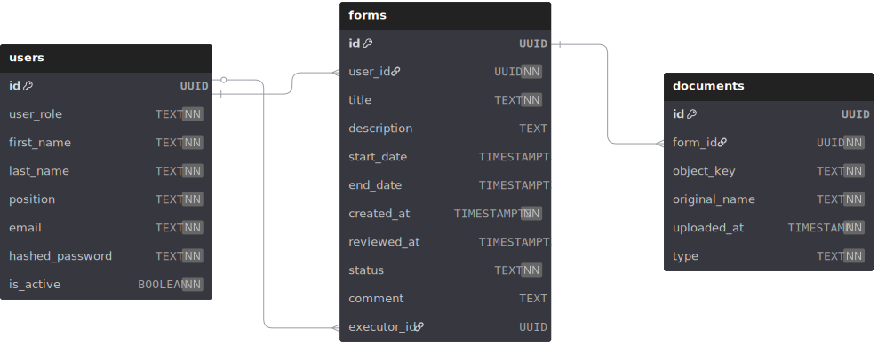

# HRMate API

<div>
    
    
    
    
</div>

## Оглавление

- [Описание](#описание)
- [Функционал](#функционал)
- [Технологии](#технологии)
- [Архитектура](#архитектура)
- [Быстрый старт](#быстрый-старт)
- [Конфигурация](#конфигурация)
- [API Documentation](#api-documentation)
- [Структура проекта](#структура-проекта)

## Описание

Сервис автоматизации взаимодействия сотрудников с отделом кадров предоставляет API для управления заявками сотрудников, пользователями и документами с гранулярным разграничением прав доступа.

### Ключевые возможности

- 🔐 **JWT-аутентификация** с ролевой моделью доступа
- 📝 **Управление заявками** — создание, согласование, отклонение, удаление
- 👥 **Управление пользователями** — активация/деактивация аккаунтов
- 📎 **Работа с документами** — загрузка и хранение в S3-совместимом хранилище
- 📊 **Swagger документация** — интерактивная документация API
- 🐳 **Контейнеризация** — полная поддержка Docker

## Функционал

### Аутентификация и авторизация

- ✅ Аутентификация и авторизация
- ✅ Регистрация пользователей (employee, hr)

### Управление заявками

- ✅ Создание заявок (employee)
- ✅ Прикрепление документов к заявкам (employee, hr)
- ✅ Согласование/отклонение заявок (hr)
- ✅ Добавление комментариев к решениям (hr)
- ✅ Фильтрация заявок по статусу
- ✅ Удаление заявок с приложенными к ним документами (admin)

### Управление пользователями

- ✅ Просмотр списка пользователей (hr, admin)
- ✅ Получение информации о текущем пользователе (hr, admin)
- ✅ Активация/деактивация пользователей (admin)

### Документы

- ✅ Загрузка документов к заявкам
- ✅ Хранение в S3-совместимом хранилище (MinIO)
- ✅ Скачивание документов

## Технологии

| Компонент            | Технология              |
|----------------------|-------------------------|
| **Язык**             | Go 1.26+                |
| **Web Framework**    | Chi Router              |
| **Database**         | PostgreSQL 17+          |
| **ORM/Драйвер**      | pgx/v5                  |
| **Миграции**         | goose                   |
| **Хранилище файлов** | MinIO (S3-compatible)   |
| **Аутентификация**   | JWT (golang-jwt/jwt)    |
| **Валидация**        | go-playground/validator |
| **Конфигурация**     | cleanenv                |
| **Транзакции**       | go-transaction-manager  |
| **Документация**     | Swagger (swaggo)        |

## Архитектура

Проект построен на принципах **Clean Architecture** с разделением на слои:

- **Handler (HTTP Layer):** Отвечает за прием REST-запросов, первичную валидацию данных, проверку авторизации и формирование JSON-ответов.
- **Service (Бизнес-логика):** Реализует ключевые правила (создание заявок, назначение HR, управление статусами, проверки доступов). Оркестрирует вызовы к базе данных и хранилищу файлов через интерфейсы.
- **Repository/Storage (Инфраструктура):** Отвечает за взаимодействие с внешними системами. Скрывает специфику работы с PostgreSQL (выполнение SQL-запросов через pgx/v5) и MinIO (интеграция с S3 API) за абстрактными интерфейсами.

### Схема взаимодействия компонентов приложения


### Ролевая модель

| Роль       | Описание      | Доступ                                                             |
|------------|---------------|--------------------------------------------------------------------|
| `employee` | Сотрудник     | Создание заявок, просмотр своих заявок                             |
| `hr`       | HR-специалист | Согласование/отклонение заявок, просмотр всех заявок и сотрудников |
| `admin`    | Администратор | Управление пользователями, полный доступ                           |


## Схема базы данных



| Связь                            | Тип        | Описание                                                                                                       |
|----------------------------------|------------|----------------------------------------------------------------------------------------------------------------|
| `users.id` → `forms.user_id`     | **1:N**    | Один пользователь может создать множество заявок. Поле `forms.user_id` — обязательный FK на автора заявки.     |
| `users.id` → `forms.executor_id` | **0..1:N** | HR-специалист может быть назначен исполнителем множества заявок. Поле `forms.executor_id` — опциональный FK.   |
| `forms.id` → `documents.form_id` | **1:N**    | Одна заявка может содержать множество документов.                                                              |


## Быстрый старт

### Запуск через Docker

1. **Клонирование репозитория**

```bash
git clone https://github.com/platonso/hrmate-api.git
cd hrmate-api
```

2. **Настройка переменных окружения**

```bash
cp env.example .env
# Отредактируйте .env под свои нужды
```

3. **Применение миграций базы данных**

```bash
make migrate-up
```

4. **Запуск всех сервисов**

```bash
make up  #API: http://localhost:8080
```

5. **Порт-форвардеры для локального доступа**

Для подключения к PostgreSQL и MinIO с вашей машины запустите соответствующие форвардеры:

```bash
make pg-port-forward      # PostgreSQL: localhost:5432
make rustfs-port-forward  # MinIO Console: http://localhost:9001
```

### Остановка


```bash
make pg-port-close      # Остановка прокси PostgreSQL
make rustfs-port-close  # Остановка прокси RustFS

make stop # Остановка контейнеров и образов проекта
make clean  # Остановка и удаления контейнеров и образов проекта

```

## Конфигурация

Все настройки задаются через переменные окружения (файл `.env`):

### HTTP сервер

```env
HTTP_PORT=8080              # Порт приложения
HTTP_READ_TIMEOUT=15s       # Таймаут чтения
HTTP_WRITE_TIMEOUT=15s      # Таймаут записи
HTTP_IDLE_TIMEOUT=60s       # Таймаут простоя
```

### PostgreSQL

```env
POSTGRES_HOST=postgres      # Хост БД
POSTGRES_PORT=5432          # Порт БД
POSTGRES_USER=postgres      # Пользователь
POSTGRES_PASSWORD=          # Пароль
POSTGRES_DB=hrmatedb        # Имя базы данных
MIGRATION_DIR=./migrations  # Директория миграций
```

### MinIO (S3-хранилище)

```env
MINIO_ENDPOINT=localhost:9000   # Адрес MinIO сервера
MINIO_ACCESS_KEY=               # Ключ доступа
MINIO_SECRET_KEY=               # Секретный ключ
MINIO_BUCKET_NAME=hrmate-docs   # Имя бакета
MINIO_USE_SSL=false             # Использование SSL

```

### Безопасность

```env
JWT_SECRET=                 # Секретный ключ JWT
ADMIN_EMAIL=                # Email admin пользователя
ADMIN_PASSWORD=             # Пароль admin пользователя
```

## API Documentation

### Основные эндпоинты

| Метод  | Путь                           | Описание                               | Доступ         |
|--------|--------------------------------|----------------------------------------|----------------|
| POST   | `/register`                    | Регистрация                            | Публичный      |
| POST   | `/login`                       | Авторизация                            | Публичный      |
| GET    | `/me`                          | Информация о текущем пользователе      | Авторизованный |
| POST   | `/forms`                       | Создать заявку                         | employee       |
| GET    | `/forms`                       | Получить свои заявки                   | employee       |
| GET    | `/documents/{id}/download`     | Скачать документ                       | Авторизованный |
| GET    | `/hr/forms`                    | Получить все заявки                    | hr             |
| PATCH  | `/hr/forms/{id}/approve`       | Согласовать заявку                     | hr             |
| PATCH  | `/hr/forms/{id}/reject`        | Отклонить заявку                       | hr             |
| GET    | `/admin/users`                 | Получить всех пользователей            | admin          |
| PATCH  | `/admin/users/{id}/activate`   | Активировать пользователя              | admin          |
| PATCH  | `/admin/users/{id}/deactivate` | Деактивировать пользователя            | admin          |
| DELETE | `/admin/forms/{id}`            | Удалить заявку и приложенные документы | admin          |


## Структура проекта

```
hrmate-api/
├── cmd/                          # Точки входа
│   ├── app/                      # Основное приложение
│   │   └── main.go
│   └── migrator/                 # Утилита миграций
│       └── main.go
├── internal/                     # Приватный код
│   ├── app/                      # Инициализация приложения
│   │   └── app.go
│   ├── config/                   # Конфигурация
│   │   └── config.go
│   ├── domain/                   # Доменные модели
│   │   ├── user.go
│   │   └── form.go
│   ├── errors/                   # Кастомные ошибки
│   │   └── errors.go
│   ├── handler/                  # HTTP обработчики
│   │   ├── auth/
│   │   ├── form/
│   │   ├── user/
│   │   ├── middleware/
│   │   └── router.go
│   ├── repository/               # Репозитории
│   │   └── postgres/
│   │       ├── user/
│   │       ├── form/
│   │       └── document/
│   ├── service/                  # Бизнес-логика
│   │   ├── auth/
│   │   ├── user/
│   │   └── form/
│   └── storage/                  # Работа с файлами
│       └── s3/
├── migrations/                   # SQL миграции
├── docs/                         # Swagger документация
├── assets/                       # Статические файлы
├── Dockerfile                    # Многоэтапная сборка
├── docker-compose.yml            # Docker оркестрация
├── Makefile                      # Команды сборки
└──  go.mod                       # Go зависимости
```

### Makefile команды

```bash
# Docker Management
make up              # Запуск Docker контейнеров
make stop            # Остановка контейнеров
make start           # Запуск остановленных контейнеров
make clean           # Полная очистка контейнеров и образов проекта

# Port Forwarding
make pg-port-forward # Запуск прокси для PostgreSQL
make pg-port-close   # Остановка прокси для PostgreSQL
make rustfs-forward  # Запуск прокси для RustFS
make rustfs-close    # Остановка прокси для RustFS

# Database Migrations
make migrate-up      # Применение всех ожидающих миграций
make migrate-down    # Откат последней миграции
make migrate-status  # Показать статус миграций

# Documentation
make swagger         # Генерация Swagger документации
```

## Лицензия

Проект распространяется под лицензией MIT. [LICENSE](./LICENSE).


